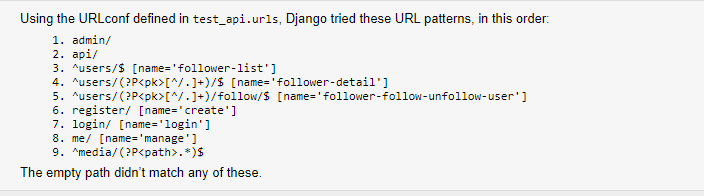
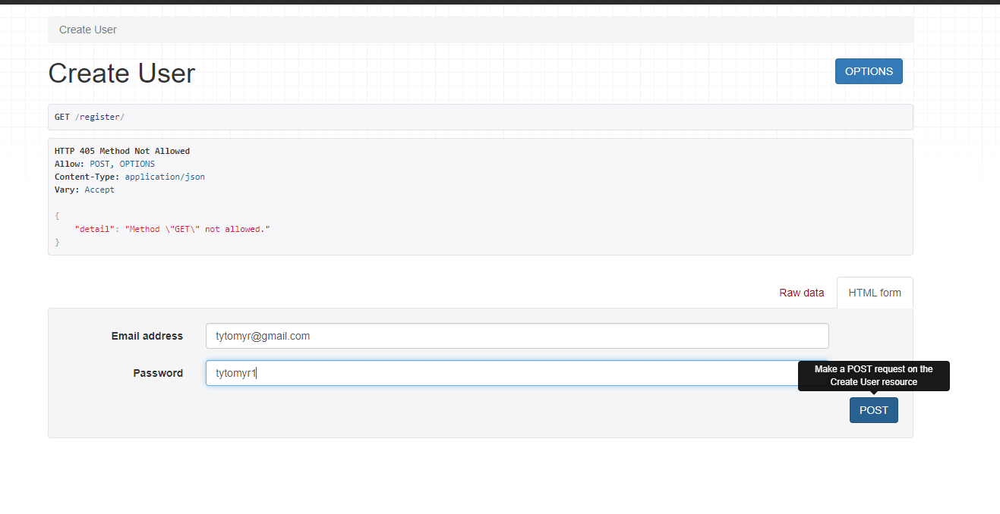
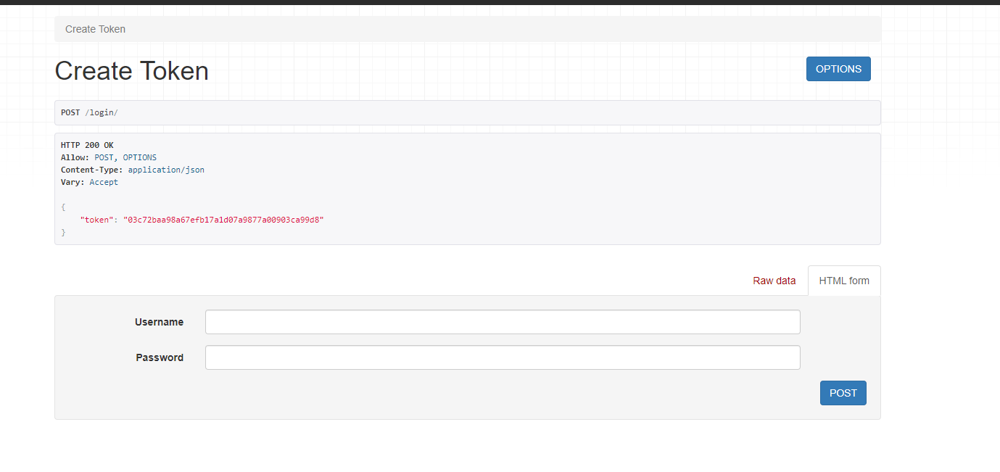

# tytomyr-test-task-solving

to start project run ```python manage.py makemigrations -> python manage.py migrate -> python manage.py runserver```

then you will be able to start API, you will have such endpoint at you disposal



to register new user go to ```http://127.0.0.1:8000/register/```




enter you credentials to create user

after you can login with your credential at this endpoint ```http://127.0.0.1:8000/login/```


at this stage you will receive your token which will allow you to interact with API features, such as: user CRUD, follow/unfollow user, post CRUD, like/dislike post, comment post
